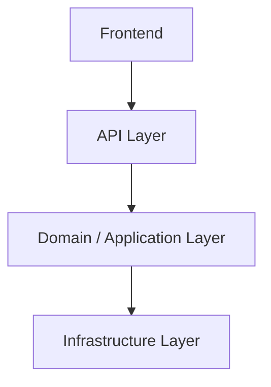

# Architecture Solution Design

| Attribute        | Value                       |
| ---------------- | --------------------------- |
| **Project**      | [Project Name]              |
| **Version**      | 0.1                         |
| **Status**       | Draft                       |

## Table of Contents

- [System Context](#system-context)
- [Architectural Approach](#architectural-approach)
- [Component Design](#component-design)
- [Data Flow](#data-flow)
- [Integration Points](#integration-points)
- [Observability](#observability)
- [Deployment Impact](#deployment-impact)
- [Security Considerations](#security-considerations)
- [Scalability Considerations](#scalability-considerations)
- [Trade-offs and Alternatives](#trade-offs-and-alternatives)
- [ADR Reference](#adr-reference)
- [Source References](#source-references)

## System Context

[Describe the system boundary: who/what interacts with it (users, external systems) and what the system is responsible for. A C4 Level-1 mermaid diagram fits here.]

## Architectural Approach

[Name the selected architecture style and summarize why it fits. Link the full evaluation in architecture-styles.md.]

### Key Design Principles

- [Principle 1, e.g. layered boundaries with dependency direction enforced.]
- [Principle 2, e.g. domain logic isolated from framework and infrastructure code.]
- [Principle 3, e.g. explicit contracts between components.]

## Component Design

[Describe each component/module, its responsibility, and its interfaces. Extend the diagram as components are defined.]

## Data Flow

[Walk through the primary end-to-end flows (e.g. the main user workflow) across components. Sequence diagrams live in ../diagrams/sequence-diagrams.md; keep this to a representative flow.]

## Integration Points

| Integration | Type | Direction | Notes |
| ----------- | ---- | --------- | ----- |
| [External service] | [REST/Webhook/Queue] | [Inbound/Outbound] | [Auth and failure expectations] |

## Observability

[How errors, traces, and metrics flow out of the system. Reference the monitoring doc and the relevant ADR once chosen.]

- [Error tracking approach.]
- [Key signals to monitor.]
- [Alerting expectations.]

## Deployment Impact

[How this design constrains or shapes deployment, e.g. single deployable unit vs. multiple services, migration ordering. Reference ops docs.]

## Security Considerations

[Top-level security properties this design must preserve. Link the security architecture doc for detail.]

## Scalability Considerations

[Expected load (reference performance/scalability NFRs) and how the design accommodates growth without rework.]

## Trade-offs and Alternatives

| Option | Pros | Cons | Verdict |
| ------ | ---- | ---- | ------- |
| [Chosen option] | [Pros] | [Cons] | Selected |
| [Alternative] | [Pros] | [Cons] | Rejected — [reason] |

## ADR Reference

- [ADR-xxx: High-Level Architecture Pattern](../../04-decisions/README.md) — link once created

## Source References

- [Architecture Styles](./architecture-styles.md)
- [Technology Stack](./technology-stack.md)
- [Feature Requirements](../../01-requirements/README.md)

---

**Last Updated**: YYYY-MM-DD
