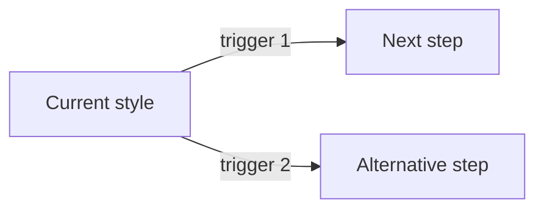

# Architecture Styles

| Attribute        | Value                       |
| ---------------- | --------------------------- |
| **Project**      | [Project Name]              |
| **Version**      | 0.1                         |
| **Status**       | Draft                       |

## Table of Contents

- [Decision Summary](#decision-summary)
- [Architecture Style Evaluation](#architecture-style-evaluation)
- [Bounded Context Alignment](#bounded-context-alignment)
- [Rationale and Trade-offs](#rationale-and-trade-offs)
- [Evolution Strategy](#evolution-strategy)
- [Scalability Alignment](#scalability-alignment)
- [Source References](#source-references)

## Decision Summary

**Selected style:** [e.g. Modular Monolith]
**Linked ADR:** [ADR-xxx](../../04-decisions/README.md)

[One paragraph summarizing the decision and its dominant constraint (team size, MVP timeline, operational budget).]

## Architecture Style Evaluation

| Criterion                      | Monolith | Modular Monolith | Microservices |
| ------------------------------ | -------- | ---------------- | ------------- |
| Team size fit                  | [Assessment] | [Assessment] | [Assessment] |
| Time to MVP                    | [Assessment] | [Assessment] | [Assessment] |
| Operational complexity         | [Assessment] | [Assessment] | [Assessment] |
| Deployment independence        | [Assessment] | [Assessment] | [Assessment] |
| Testability                    | [Assessment] | [Assessment] | [Assessment] |
| Evolution path                 | [Assessment] | [Assessment] | [Assessment] |

**Why [selected style] wins:** [Rationale tied to the criteria above.]

## Bounded Context Alignment

> For modular designs, map each bounded context to its module and note cross-module dependencies. Keep dependencies explicit and one-directional where possible.

| Bounded Context | Module/Package | Responsibility | Depends On |
| --------------- | -------------- | -------------- | ---------- |
| [Context]       | [Module]       | [Responsibility] | [Modules] |

## Rationale and Trade-offs

- **Pros**: [List]
- **Cons / accepted risks**: [List, each with mitigation]

## Evolution Strategy

[Describe how the architecture can evolve if triggers fire (growth, team scale, load).]

### Trigger-based extraction criteria

- [Trigger 1, e.g. a module needs independent scaling or deployment cadence.]
- [Trigger 2, e.g. team ownership splits across a module boundary.]

### Migration path

1. [Step 1, e.g. harden module boundaries and contracts.]
2. [Step 2, e.g. extract the first service behind the existing API.]

## Scalability Alignment

[How the chosen style satisfies the scalability NFRs, and what would need to change at 10x load.]

## Source References

- [Architecture Solution Design](./architecture-solution-design.md)
- [Technology Stack](./technology-stack.md)
- [ADR Decision Log](../../04-decisions/README.md)

---

**Last Updated**: YYYY-MM-DD
