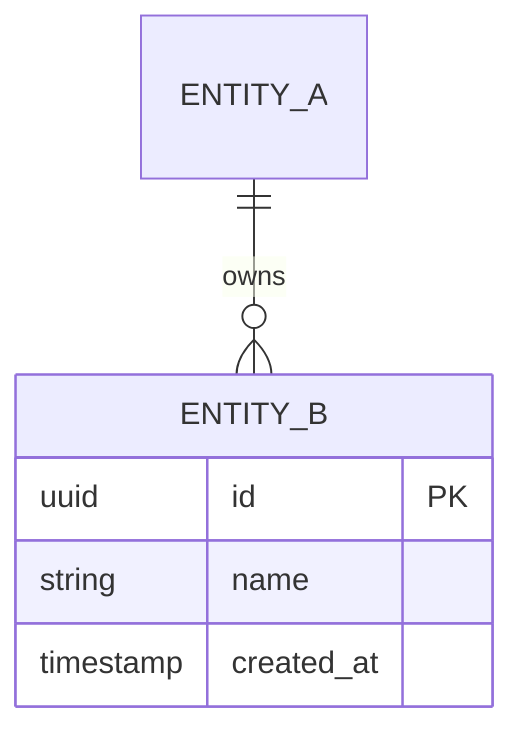

# Database Design

| Attribute        | Value                       |
| ---------------- | --------------------------- |
| **Project**      | [Project Name]              |
| **Version**      | 0.1                         |
| **Status**       | Draft                       |

## Table of Contents

- [Design Scope and Assumptions](#design-scope-and-assumptions)
- [Data Domains](#data-domains)
- [Core Entities](#core-entities)
- [Relationships](#relationships)
- [Entity-Relationship Diagram (ERD)](#entity-relationship-diagram-erd)
- [Schema Documentation](#schema-documentation)
- [Constraints and Integrity Rules](#constraints-and-integrity-rules)
- [Access Patterns and Indexing Notes](#access-patterns-and-indexing-notes)
- [Migration and Evolution Considerations](#migration-and-evolution-considerations)
- [Security and Data Governance](#security-and-data-governance)
- [Risks and Open Questions](#risks-and-open-questions)
- [Traceability to Requirements](#traceability-to-requirements)
- [Source References](#source-references)

## Design Scope and Assumptions

- [Assumption 1, e.g. single relational database for MVP.]
- [Assumption 2, e.g. multi-tenancy model: one account owns its own data.]

## Data Domains

| Domain | Entities | Responsibility |
| ------ | -------- | -------------- |
| [Identity] | [users, sessions] | [What this domain owns] |
| [Core domain] | [entities] | [What this domain owns] |

## Core Entities

| Entity | Purpose | Key Attributes | Owning Domain |
| ------ | ------- | -------------- | ------------- |
| [entity] | [Purpose] | [Attributes] | [Domain] |

## Relationships

- [Entity A] **1 — N** [Entity B]: [cardinality rules, cascade behavior].
- [Entity B] **N — M** [Entity C] via `[join_table]`: [rules].

## Entity-Relationship Diagram (ERD)

## Schema Documentation

> One subsection per table: columns with types and constraints, plus notes on indexes and lifecycle.

### 1. `[table_name]`

| Column | Type | Constraints | Notes |
| ------ | ---- | ----------- | ----- |
| `id` | uuid | PK | [Generation strategy] |
| `created_at` | timestamptz | NOT NULL, default now() | |
| `updated_at` | timestamptz | NOT NULL, default now() | |

**Notes:** [Lifecycle states, soft-delete behavior, retention rules.]

## Constraints and Integrity Rules

- [Rule 1, e.g. uniqueness constraint that enforces a business rule.]
- [Rule 2, e.g. check constraint limiting allowed statuses.]

## Access Patterns and Indexing Notes

| Query / Access Pattern | Frequency | Supporting Index |
| ---------------------- | --------- | ---------------- |
| [List by owner + status] | High | [index definition] |

## Migration and Evolution Considerations

- Migrations are additive-first and backward-compatible (see the migration ADR in [04-decisions](../../04-decisions/README.md)).
- [Destructive change policy.]
- [Data backfill approach.]

## Security and Data Governance

- [Row-level access enforcement approach.]
- [Sensitive data columns and their protection.]
- [Retention and deletion behavior per privacy NFR.]

## Risks and Open Questions

- [Risk or open question with mitigation/owner.]

## Traceability to Requirements

| Requirement | Schema Element(s) | Notes |
| ----------- | ----------------- | ----- |
| [FR-xxx-xx] | [table/column]    | [Coverage note] |

## Source References

- [Database Domain Overview](./README.md)
- [Feature Requirements](../../01-requirements/README.md)
- [ADR Decision Log](../../04-decisions/README.md)

---

**Last Updated**: YYYY-MM-DD
