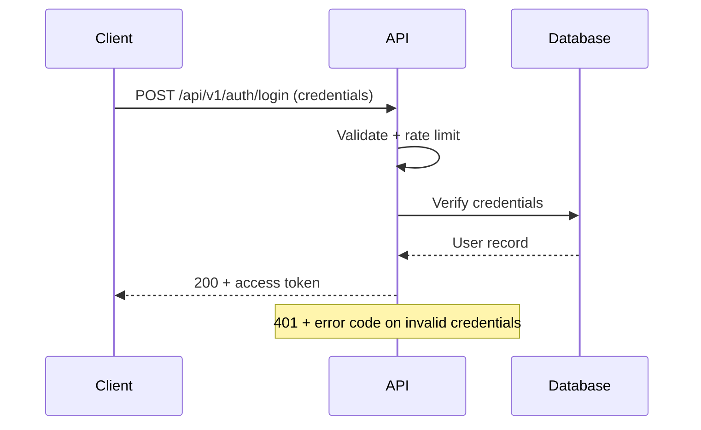

# Sequence Diagrams

| Attribute        | Value                       |
| ---------------- | --------------------------- |
| **Project**      | [Project Name]              |
| **Version**      | 0.1                         |
| **Status**       | Draft                       |

## Table of Contents

- [How to Use](#how-to-use)
- [1) [Flow Name, e.g. Authentication and Session Validation]](#1-flow-name-eg-authentication-and-session-validation)
- [Diagram Coverage by Feature](#diagram-coverage-by-feature)
- [Source References](#source-references)

## How to Use

One numbered section per key interaction flow. Each flow contains a Mermaid `sequenceDiagram`
plus a short "Key details" note covering edge cases, error paths, and security checks.
Add a row to the [coverage table](#diagram-coverage-by-feature) for every flow.

## 1) [Flow Name, e.g. Authentication and Session Validation]

> Example placeholder flow — replace with your own critical flows (authentication, primary
> business workflow, error handling path, deployment, ...).

**Key details:**

- [Edge case or error path, e.g. rate limiting after N failed attempts.]
- [Security check, e.g. token lifetime and validation on every request.]

## Diagram Coverage by Feature

| Flow | Covers Feature(s) | Covers NFR(s) | Status |
| ---- | ----------------- | ------------- | ------ |
| [Flow 1] | [F-xxx] | [NFR-Xnn] | Draft |

## Source References

- [Feature Requirements](../../01-requirements/README.md)
- [Contract Catalog](../contracts/contract-catalog.md)
- [Architecture Solution Design](../core/architecture-solution-design.md)

---

**Last Updated**: YYYY-MM-DD
