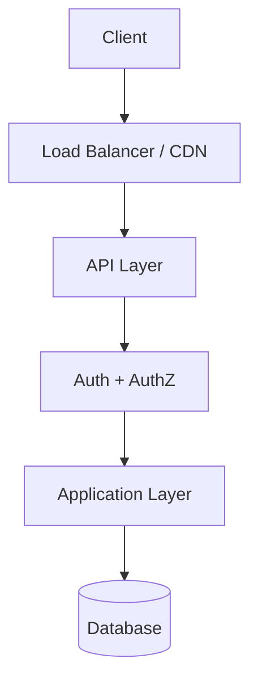
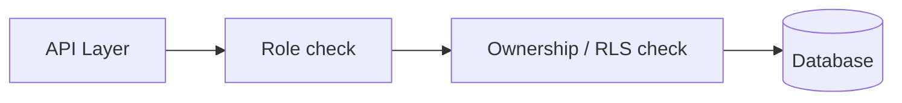

# Security Architecture

| Attribute        | Value                       |
| ---------------- | --------------------------- |
| **Project**      | [Project Name]              |
| **Version**      | 0.1                         |
| **Status**       | Draft                       |

## Table of Contents

- [Security Objectives and Scope](#security-objectives-and-scope)
- [Security Architecture Overview](#security-architecture-overview)
- [Authentication Strategy](#authentication-strategy)
- [Authorization Model](#authorization-model)
- [Data Protection](#data-protection)
- [OWASP Top 10 Compliance Mapping](#owasp-top-10-compliance-mapping)
- [Network Security Architecture](#network-security-architecture)
- [Secrets Management Strategy](#secrets-management-strategy)
- [Security Headers and Web Best Practices](#security-headers-and-web-best-practices)
- [Input Validation and Sanitization](#input-validation-and-sanitization)
- [API Security](#api-security)
- [Security Monitoring and Incident Response](#security-monitoring-and-incident-response)
- [Secure Development and Security Testing Approach](#secure-development-and-security-testing-approach)
- [ADR and Diagram References](#adr-and-diagram-references)
- [Source References](#source-references)

## Security Objectives and Scope

- [Objective 1, e.g. protect user data from unauthorized access.]
- [Objective 2, e.g. maintain availability under load and abuse.]
- [Scope: what is in and out of bounds for this document.]

## Security Architecture Overview

[Provide a high-level view of how security layers compose. A mermaid diagram showing the defense-in-depth layers works well here.]



## Authentication Strategy

### Selected Model

[State the chosen authentication mechanism (e.g. JWT access + refresh tokens, session cookies, OAuth 2.0, SSO).]

### Authentication Endpoints

| Endpoint | Method | Purpose |
| -------- | ------ | ------- |
| `/api/v1/auth/login` | POST | [Description] |
| `/api/v1/auth/register` | POST | [Description] |
| `/api/v1/auth/refresh` | POST | [Description] |
| `/api/v1/auth/logout` | POST | [Description] |

### Authentication Controls

- [Rate limiting on login attempts.]
- [Password complexity requirements.]
- [Email verification flow.]
- [Token lifetime and revocation rules.]

### Token Structure

```json
{
  "sub": "user_id",
  "role": "string",
  "iat": 1234567890,
  "exp": 1234571490
}
```

> Adjust claims to match your authorization model. Document any custom claims.

## Authorization Model

### RBAC + Resource Attributes

[Describe the role hierarchy and how resource-level ownership is enforced.]

### Least-Privilege Rules

- [Rule 1, e.g. role X cannot access resources owned by role Y.]
- [Rule 2, e.g. all requests are denied by default.]

### Authorization Flow



## Data Protection

### Encryption at Rest

- [Which columns/fields are encrypted.]
- [Key management approach.]

### Encryption in Transit

- [TLS version and cipher requirements.]
- [Internal service communication.]

### Sensitive Data Handling

- [Which fields are classified as sensitive.]
- [Logging redaction rules.]
- [Deletion behavior per privacy NFR.]

## OWASP Top 10 Compliance Mapping

| OWASP Category | Controls in Place | Status |
| -------------- | ----------------- | ------ |
| A01: Broken Access Control | [Controls] | [Draft/Implemented] |
| A02: Cryptographic Failures | [Controls] | [Draft/Implemented] |
| A03: Injection | [Controls] | [Draft/Implemented] |
| A04: Insecure Design | [Controls] | [Draft/Implemented] |
| A05: Security Misconfiguration | [Controls] | [Draft/Implemented] |
| A06: Vulnerable Components | [Controls] | [Draft/Implemented] |
| A07: Auth Failures | [Controls] | [Draft/Implemented] |
| A08: Data Integrity Failures | [Controls] | [Draft/Implemented] |
| A09: Logging Failures | [Controls] | [Draft/Implemented] |
| A10: SSRF | [Controls] | [Draft/Implemented] |

## Network Security Architecture

- [VPC / subnet layout.]
- [Ingress/egress rules.]
- [WAF or DDoS protection.]

## Secrets Management Strategy

| Secret Type | Storage | Rotation | Access |
| ----------- | ------- | -------- | ------ |
| Database credentials | [Platform secrets manager] | [On compromise / schedule] | [Least-privilege] |
| API keys | [Platform secrets manager] | [Per-policy] | [Service account] |
| JWT signing key | [Platform secrets manager] | [On schedule] | [Backend only] |

## Security Headers and Web Best Practices

| Header | Value | Purpose |
| ------ | ----- | ------- |
| `Strict-Transport-Security` | `max-age=31536000; includeSubDomains` | Force HTTPS |
| `X-Content-Type-Options` | `nosniff` | Prevent MIME sniffing |
| `X-Frame-Options` | `DENY` | Prevent clickjacking |
| `Content-Security-Policy` | [CSP directives] | Restrict resource origins |
| `Referrer-Policy` | `strict-origin-when-cross-origin` | Limit referrer leakage |

## Input Validation and Sanitization

- [Schema validation on all request bodies (e.g. Pydantic, Zod, JSON Schema).]
- [SQL parameterization / ORM usage — no raw queries.]
- [XSS prevention via output encoding.]
- [File upload validation: type, size, content inspection.]

## API Security

- [All endpoints require authentication unless explicitly public.]
- [Rate limiting per endpoint class (see API Design Standards).]
- [CORS policy: allowed origins, credentials, headers.]
- [Idempotency for non-GET mutations where appropriate.]

## Security Monitoring and Incident Response

### Monitoring

- [Auth failures and brute-force attempts are logged and alerted.]
- [Dependency vulnerability scanning in CI.]
- [Runtime dependency alerts (Dependabot, Snyk, etc.).]

### Incident Response Lifecycle

1. **Detect** — alert fires or user report received
2. **Triage** — assess severity and scope
3. **Contain** — revoke access, block IPs, disable compromised accounts
4. **Eradicate** — patch the vulnerability
5. **Recover** — redeploy from clean state
6. **Review** — post-incident report within [N] business days

## Secure Development and Security Testing Approach

- [SAST in CI pipeline.]
- [Dependency audit in CI pipeline.]
- [Periodic penetration testing schedule.]
- [Security training for contributors.]

## ADR and Diagram References

- [Authentication ADR](../../04-decisions/README.md)
- [Secrets Management ADR](../../04-decisions/README.md)
- [Containerization ADR](../../04-decisions/README.md)
- [Threat Model](./threat-model.md)

## Source References

- [API Design Standards](../api/api-design-standards.md)
- [Deployment Architecture](../ops/deployment-architecture.md)
- [Feature Requirements](../../01-requirements/README.md)

---

**Last Updated**: YYYY-MM-DD
