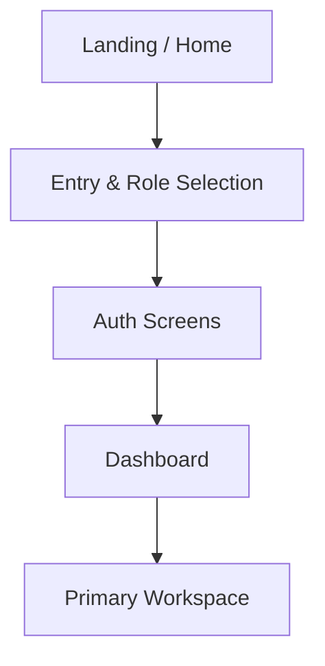

# Prototype Brief

| Attribute   | Value          |
| ----------- | -------------- |
| **Project** | [Project Name] |
| **Version** | 0.1            |
| **Status**  | Draft          |

## Table of Contents

- [Purpose](#purpose)
- [Product Context](#product-context)
- [Goals](#goals)
- [Success Criteria](#success-criteria)
- [Target Users](#target-users)
- [MVP Prototype Scope](#mvp-prototype-scope)
  - [In Scope](#in-scope)
  - [Out of Scope](#out-of-scope)
- [Pages and Sections per Page](#pages-and-sections-per-page)
- [Information Architecture](#information-architecture)
  - [Sitemap](#sitemap)
  - [Navigation Model](#navigation-model)
- [Key User Flows](#key-user-flows)
- [Assumptions](#assumptions)
- [Requirements Coverage Matrix](#requirements-coverage-matrix)
- [Source References](#source-references)

## Purpose

[State the prototype's purpose: validate core user experience before engineering investment. Link to the design tool (Pencil `.pen` file).]

## Product Context

[One paragraph: what the product does and why a prototype matters for this specific project.]

## Goals

- [Goal 1, e.g. validate the primary user flow end-to-end.]
- [Goal 2, e.g. confirm the information architecture with stakeholders.]
- [Goal 3, e.g. establish the visual direction for the engineering team.]

## Success Criteria

- [Criterion 1, e.g. stakeholder sign-off on prototype brief.]
- [Criterion 2, e.g. core flows are completable without confusion in usability testing.]

## Target Users

| Persona   | Name   | Role   | Notes                           |
| --------- | ------ | ------ | ------------------------------- |
| Primary   | [Name] | [Role] | [Context from user-personas.md] |
| Secondary | [Name] | [Role] | [Context]                       |

## MVP Prototype Scope

### In Scope

- [Page or flow 1]
- [Page or flow 2]

### Out of Scope

- [Page or flow X]
- [Deferred capability]

## Pages and Sections per Page

> List every screen the prototype covers. For each, note the key sections and state coverage.

### 1. [Page Name]

- [Section 1]
- [Section 2]
- [State coverage: empty, loading, error, populated]

### 2. [Page Name]

- [Section 1]
- [Section 2]
- [State coverage]

> Copy this block for each additional page.

## Information Architecture

### Sitemap

### Navigation Model

- [Primary navigation pattern, e.g. sidebar, top bar, bottom tabs.]
- [How the user moves between sections.]

## Key User Flows

### Flow 1: [Flow Name]

> Walk through the steps as a numbered list. Reference page numbers above.

1. User lands on [Page 1]
2. User [action] → navigates to [Page 2]
3. [Expected outcome]

### Flow 2: [Flow Name]

1. [Step]
2. [Step]

## Assumptions

- [Assumption 1, e.g. mobile responsive is not needed for MVP prototype.]
- [Assumption 2, e.g. prototype uses placeholder data only.]

## Requirements Coverage Matrix

| Screen/Flow | Covers FR(s) | Covers NFR(s) | Milestone |
| ----------- | ------------ | ------------- | --------- |
| [Page 1]    | [FR-xxx]     | [NFR-Xnn]     | MVP       |

## Source References

- [Project Overview](../00-context/overview.md)
- [User Personas](../00-context/user-personas.md)
- [Requirements by Feature](../01-requirements/README.md)
- [Architecture](../03-architecture/README.md)

---

**Last Updated**: YYYY-MM-DD
